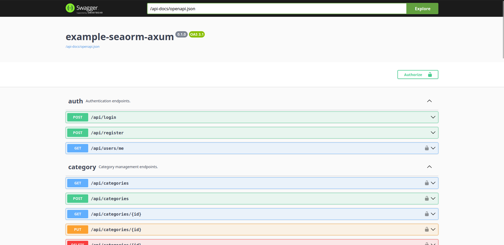

### Example Sea Orm in Actix


### Migrate

```sh
sea-orm-cli migrate init
```

### Generate Entity

```sh
sea-orm-cli generate entity -o src/entities
```

### Migrate run UP

```sh
sea-orm-cli migrate up
```

### Migrate run Down

```sh
sea-orm-cli migrate down
```


### OpenApi in Utoipa

